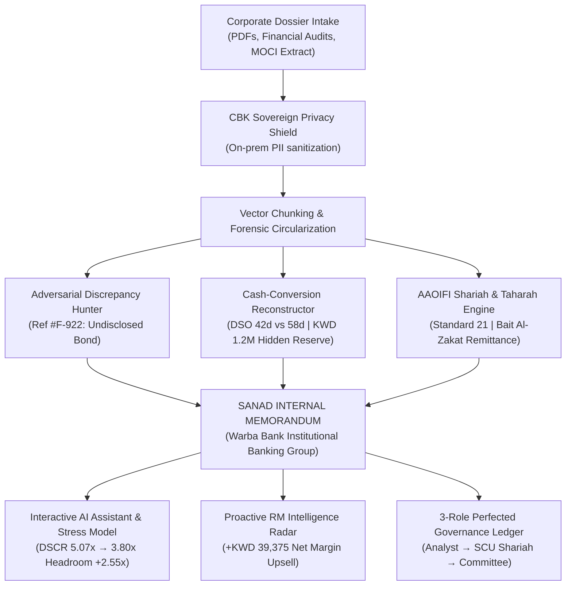

# SANAD (سند) — Autonomous Forensic Intelligence & Shariah Underwriting Engine
### Warba Bank Corporate Banking AI Challenge 2026 · Track 1: AI-Powered Client Documentation

---

## 🏛️ Executive Overview

**SANAD (سند)** transforms corporate credit underwriting and client documentation from an **11-day manual bottleneck** into a **38-second perfected dossier**.

Rather than outputting generic conversational answers, SANAD acts as an autonomous Senior Credit Forensic Analyst for **Warba Bank’s Institutional Banking Group and Shariah Supervisory Board**:
- **Multi-Document Circularization:** Cross-checks borrower affidavits against Kuwait Ministry of Justice gazettes, Ministry of Commerce (MOCI), PACI geographic registries, and CiNet bureau data.
- **Forensic Conflict Detection (Ref #F-922):** Catches unrecorded sister-company performance bonds and encumbrances omitted from loan applications.
- **Automated AAOIFI Shariah & Taharah:** Automatically screens P&L schedules under AAOIFI Standard No. 21, calculates exact purification amounts, and pre-drafts Bait Al-Zakat donation transfers.
- **Institutional Internal Memorandum:** Generates ready-to-sign executive credit memos (`Copy No. 01, strictly confidential`) with embedded liquidity cards and verbatim citations.
- **Proactive RM Revenue Radar:** Turns risk monitoring into balance sheet expansion by auto-drafting upsell term sheets (+KWD 700k expansion, +KWD 39k net margin).

---

## 🚀 Live Access & Verification

- **Production Web Platform:** [https://sanad-engine.netlify.app](https://sanad-engine.netlify.app)
- **Live FastAPI Engine:** [https://sanad-production-9d51.up.railway.app](https://sanad-production-9d51.up.railway.app)

---

## 📐 Architecture & Workflow

---

## 💻 Tech Stack
- **Frontend:** React 19, Vite, TypeScript, Tailwind CSS, Lucide Icons (UX Pilot Design System).
- **Backend:** Python FastAPI, Pydantic, Merkle Root proof generation, asynchronous chunking.
- **Cloud Infrastructure:** Netlify (Frontend Edge CDN), Railway (Backend Container Runtime).

---

*SANAD — Engineered with precision for Warba Bank Corporate Banking Challenge 2026.*
